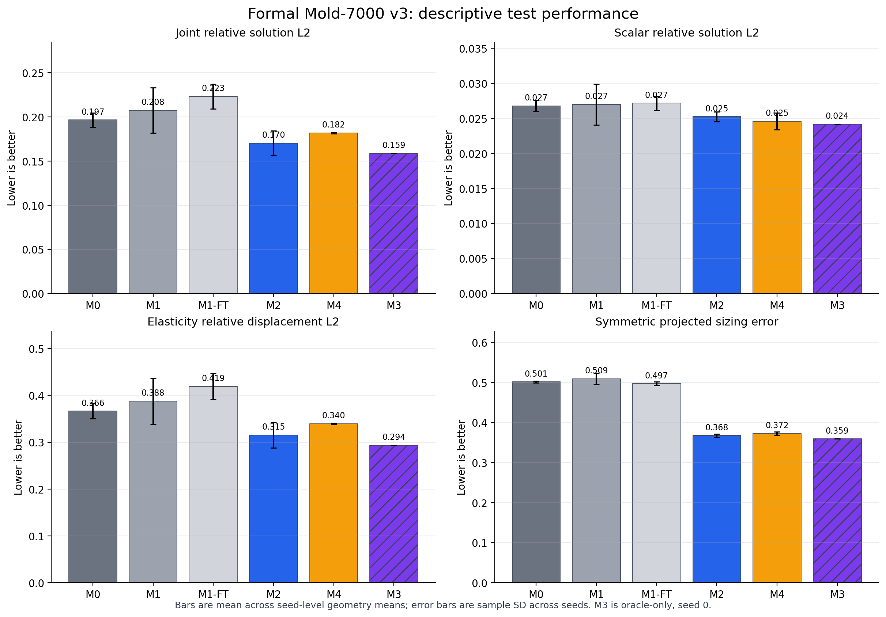
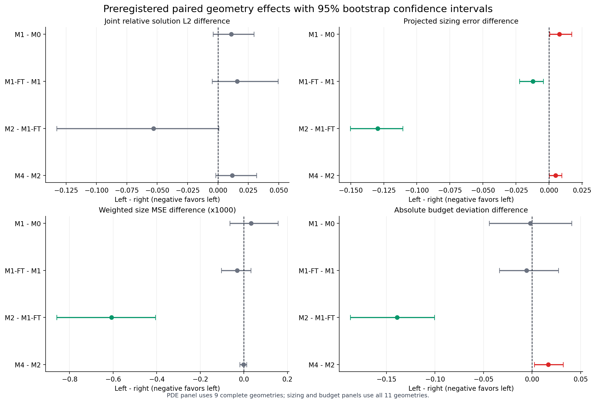
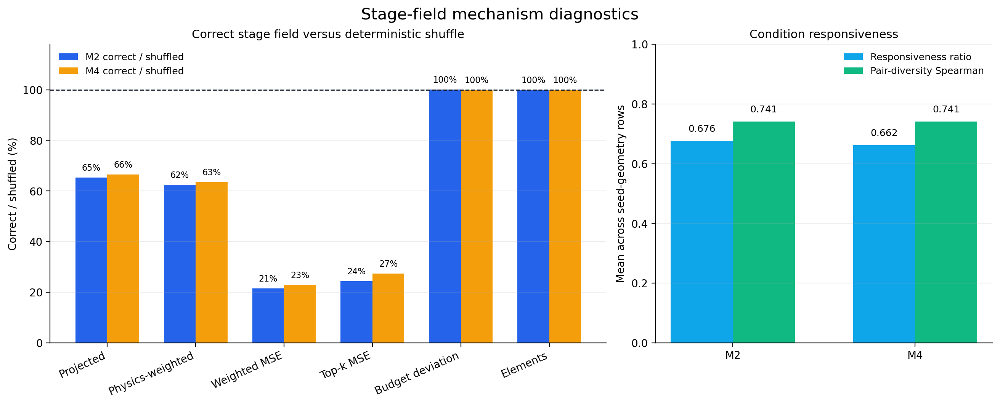

# 正式实验结果报告：formal-mold7000-v3

> 报告日期：2026-08-28（北京时间）  
> 实验状态：`train → evaluate → analyze` 三阶段全部完成，Gate T、Gate E、Gate A 均通过  
> 报告性质：冻结正式实验的结果报告，不改变任何模型架构、forward、loss、数据、方法身份、指标或统计规则  
> 主要证据目录：[`amber/output/formal_experiments/formal-mold7000-v3`](amber/output/formal_experiments/formal-mold7000-v3)

## 摘要

本实验在冻结协议 `formal-mold7000-v3` 下，完成了 16 次正式训练、27 个正式 PDE 评估任务以及预注册的 geometry-level 统计分析。所有训练均完成 101 epochs 和 12,928 updates；所有学习方法、诊断变体和静态参照均覆盖冻结 test 集的 42 个样本；分析最终形成 1,134 条统一样本记录、864 条 geometry 汇总和 210 条预注册统计比较。

实验得到的是一组有效的混合结果：

1. **M2 的 condition-dependent stage field 对 teacher sizing imitation 和关键区域误差有明确、稳定的独立贡献。** 相对额外训练控制 M1-FT，M2 的对称投影误差降低 26.1%，physics-weighted 投影误差降低 26.8%，weighted size MSE 降低 69.1%，top-k MSE 降低 69.5%；这些差异的 geometry bootstrap 95% CI 均不跨 0，11/11 geometry 方向一致。
2. **模型确实使用了正确的 stage field，而不是仅依靠网络容量或平均预算。** M2/M4 的 correct-vs-shuffled 对照在实际元素数几乎不变的情况下，使核心 sizing 指标降低约 33%–79%；两种方法的 condition responsiveness ratio 分别为 0.676 和 0.662，pair-diversity Spearman 均约为 0.741。
3. **M1 的 physics-weighted loss 没有证明优于 M0。** 主要 PDE、投影和 weighted sizing 指标均无净收益；对称投影误差的 bootstrap CI 反而支持 M1 略差。
4. **M4 的 gated residual stack 没有证明优于 M2。** M4 的对称投影误差、top-k MSE、预算偏差和联合 PDE 均值均不优于 M2；同 checkpoint 的 final 也没有优于 expert-only。因此，gate/correction 非零不能被解释为机制有效。
5. **PDE 物理收益尚未得到充分证明。** M2 相对 M1-FT 的联合相对 solution L2 均值从 0.2233 降至 0.1703，scalar 与 elasticity 均值方向一致，但主要配对 CI 仍跨 0；同时 M2 的实际元素数比 M1-FT 高约 24.5%，不能把该 PDE 改善解释成严格同预算下的纯模型收益。
6. **全局 Holm 校正后没有任何比较达到 `p < 0.05`。** 210 项比较中有 64 项 bootstrap CI 不跨 0、51 项原始 Wilcoxon `p < 0.05`，但 Holm 校正后为 0 项。因此，本报告使用“bootstrap 支持”“方向性趋势”或“不支持”等表述，不声称获得全局校正后的显著性证明。

综合判断：**当前最受证据支持的正式路线是 M2 feature-only，而不是 M4 gated residual。可以确认的贡献应收缩为 condition-aware stage-field feature injection 对 sizing/关键区域 imitation 的贡献；不能同时声称 weighted loss、gated correction 或真实 PDE 泛化已经被证明。**

### 冻结研究问题判定

| 冻结研究问题 | 判定 | 结论范围 |
|---|---|---|
| M1−M0：physics-weighted loss 是否有效 | **不支持** | 未观察到 sizing 或 PDE 净收益，部分 bootstrap 结果指向退化 |
| M1-FT−M1：收益是否只是额外训练 | **局部支持** | 额外训练改善约 2.4% 的投影 sizing，但不改善 PDE |
| M2−M1-FT：stage field 是否有独立贡献 | **支持 sizing/机制结论** | sizing、关键区域和预算利用改善；PDE 仅为趋势 |
| M4−M2：gated residual 是否有净贡献 | **不支持** | M4 未超过更简单的 M2，若干指标略差 |
| M4 final−expert-only：gate/final 组合是否有效 | **不支持** | final 没有稳定优于同 checkpoint expert-only |
| correct−shuffled：模型是否真实使用 condition field | **强力支持 sizing 机制** | 相同模型、近似相同预算下，正确字段显著改善 sizing |
| sizing 改善是否转化为真实 PDE 改善 | **证据不足** | 均值方向较好，但主要 CI 跨 0、预算不匹配且 Holm 后无显著项 |

## 1. 报告范围、权威来源与解释层级

本报告的实验定义来自：

- [`正式实验前的确认项冻结.md`](正式实验前的确认项冻结.md)；
- [`最终确认的实验路线.md`](最终确认的实验路线.md)；
- 机器可执行的 [`formal_experiment_plan.yaml`](../amber/config/formal_experiment_plan.yaml)；
- 冻结运行入口和三个阶段形成的真实产物。

本报告按照既定优先级，以冻结代码、计划文件、版本标识和实际产物为准。

本报告只回答本轮 Mold-7000 正式实验问题。不讨论部署，不引入实验后新增指标，不执行 post-hoc 重训或模型修改，也不把 pilot、validation 或原 AMBER 论文中的外部数字混入正式结论。

## 2. 冻结协议与实验身份

### 2.1 版本、环境和数据

| 项目 | 冻结值 |
|---|---|
| Protocol | `formal-mold7000-v3` |
| AMBER commit / tag | `b74c803b6832d100e3d0cba09d049a65197c1310` / `preformal-mold7000-v3` |
| dataest-pipeline commit / tag | `fc11801a248156442a6635e85104ef05da9a53fc` / `preformal-mold7000-v3` |
| Dataset fingerprint | `26f333eb00e4818225f98ad27a77cf0eea802903ff4be3af78d094bf0f085c7c` |
| Conda / Python | `AMBER_neurips` / Python 3.11.15 |
| PyTorch / CUDA build | PyTorch 2.10.0 + CUDA 12.8 |
| GPU | NVIDIA GeForce RTX 5060 Laptop GPU |
| Desired element budget | 7,000 |
| Inference steps | 3 |
| Train / Val / Test samples | 182 / 34 / 42 |
| Train / Val / Test geometries | 48 / 10 / 11 |
| Test PDE samples | scalar elliptic 20；linear elasticity 22 |

16 个 `run_metadata.json`、`code_version.json` 和 `dataset_version.json` 记录的两个 commit 与数据指纹完全一致，运行时两个仓库均为 clean。数据 split 继续以 geometry 隔离，没有因为正式 test 结果改变过滤或分组。

### 2.2 方法和对照身份

| Analysis ID | Seeds | 初始化 | 冻结作用与解释边界 |
|---|---:|---|---|
| M0 | 0,1,2 | 从头训练 | 原始未加权 geometry-only baseline |
| M1 | 0,1,2 | 从头训练 | 只隔离 physics-weighted loss |
| M1-FT | 0,1,2 | 同 seed M1，weights-only，全新 optimizer/scheduler | 控制额外 101 epochs 的训练预算 |
| M2 | 0,1,2 | 同 seed M1 | stage-field feature-only；gate/correction 严格为 0 |
| M4 | 0,1,2 | 同 seed M1 | stage field + gated residual stack |
| M3 | 0 | seed-0 M1 | 使用 teacher final indicator 的 `oracle_only` 诊断，不是部署主方法 |
| R0-Initial | — | 静态参照 | 低预算 sanity reference，不预算匹配 |
| R1-Teacher | — | 静态参照 | teacher target mesh reference，不是严格理论上界 |

M2/M4 的 stage field 从 `probe_points` 直接 IDW 投影到每一步当前 learner mesh；正式路径不读取 expert mesh。M4 的 `final` 与 `expert_only` 来自同一 checkpoint，M2/M4 的 shuffled 对照也不重新训练。

### 2.3 Shuffle 实际语义的审计披露

冻结人工说明曾将 shuffle 简写为“同一 geometry 内按 condition 字典序循环错配”。真实冻结实现与六份正式 mapping 产物的精确语义是：

1. 在每个 geometry 内按 `sample_id` 字典序排序；
2. 循环平移一位，把来源样本的 `stage_field_path` 赋给目标样本；
3. geometry、目标 sample/condition 身份、监督 indicator 和 checkpoint 保持不变；
4. 只替换 stage field。

六份 M2/M4、三 seed mapping 文件完全相同；每份含 42 条映射、覆盖 11 个 geometry，fixed point 为 0。因此，该对照仍是确定性的 same-geometry cyclic derangement，机制比较有效；本报告只使用“按 `sample_id` 字典序”这一真实表述。历史冻结文档保持不变。

## 3. 指标、统计与失败策略

### 3.1 指标语义

- 一级 PDE 指标：`solution_l2_relative`。它表示**相对冻结强 reference 的差异**，不是相对 ground truth 的绝对真误差。
- 二级 PDE 指标：`qoi_absolute_error`、`qoi_relative_error`。
- 主 sizing 指标：`projected_l2_error_symmetric`。
- 关键区域指标：`physics_weighted_projected_l2_error`、`weighted_size_mse`、`topk_high_importance_mse`。
- 历史 `_size_l2` 字段在真实实现中计算的是 MSE；本报告统一使用语义正确的 MSE 名称，不将其解释为 RMSE/L2。
- 不报告 Energy/H1；冻结分析中对应值为 `null`。

### 3.2 统计口径

- 独立单位是 `geometry_id`，不是 condition sample。
- 同一 geometry 内先按 PDE 对 conditions 求均值。
- 多 seed 报告 seed-level geometry mean 的均值 ± sample standard deviation。
- 配对 geometry bootstrap：10,000 次，seed `20260821`，95% CI。
- 配对 Wilcoxon：双侧；210 项统计行统一做 Holm 校正。
- 对所有“越小越好”的误差指标，配对差定义为 `left − right`；负值支持 left 方法。

### 3.3 失败处理

所有失败行均保留。只有 mesh generation 与 PDE solver 同时成功时才记 `joint_success=true`。geometry-level 的主要 PDE 数值要求该 geometry 组内全部 conditions joint-success，否则该 geometry 的 PDE 值留空，不以删行方式制造完整样本。

这使主要 learned-method PDE 对比使用 9 个完整 geometry，而 sizing、预算和成功率对比使用全部 11 个 geometry。

## 4. 三阶段执行与完整性验收

### 4.1 Train：PASS

- 16/16 个预注册 fit 均为 `status=complete`。
- 每个 fit 均完成 101 epochs、12,928 updates，并产生 `checkpoints/last.ckpt` 与完整 `training_summary.json`。
- 总更新数为 206,848，总训练 wall time 为 133.440 小时。
- 全部 run 的峰值 GPU 显存约为 6.77 GiB。
- `run_test_after_fit=false`；最后一个 M3 fit 完成后才统一进入 evaluate，符合 train/test 隔离。
- M1-FT/M2/M4/M3 的初始化记录均指向同 seed M1 `last.ckpt`；M1-FT 使用 fresh optimizer/scheduler。
- 训练日志中的 `No embedding config` 是冻结模型没有额外 embedding 配置的状态提示，不是缺失输入或训练失败。

| 方法 | Fits | 单次训练小时，均值 ± SD | 说明 |
|---|---:|---:|---|
| M0 | 3 | 8.546 ± 0.109 | 从头训练 |
| M1 | 3 | 8.293 ± 0.399 | 从头训练 |
| M1-FT | 3 | 8.507 ± 0.400 | 还需前置同 seed M1 |
| M2 | 3 | 8.046 ± 0.634 | 还需前置同 seed M1 |
| M4 | 3 | 8.245 ± 0.782 | 还需前置同 seed M1 |
| M3 oracle | 1 | 8.526 | 还需前置 seed-0 M1 |

因此，推荐两阶段流程的有效平均训练成本约为：M1→M2 16.34 小时/seed，M1→M4 16.54 小时/seed。只报告第二阶段约 8 小时会低估正式方法的完整成本。

### 4.2 Evaluate：PASS，含一次已审计人工中断

第一次 evaluate 在 M0 seed 1 的测试过程中被人工 `Ctrl+C` 中断，日志明确记录 `KeyboardInterrupt`。随后继续使用默认、无 `--overwrite` 的冻结 evaluate 入口，最终完整结束。最终文件闭合证明该中断没有污染正式结果：

- 16 个 normal checkpoint evaluation 全部完成；
- 6 个 M2/M4 shuffled evaluation 全部完成；
- 3 个 M4 expert-only PDE evaluation 全部完成；
- R0/R1 两个 static reference evaluation 全部完成；
- 合计 27 个 PDE job × 42 samples = 1,134 行；
- 22 个需要 completion marker 的 normal/shuffle evaluation marker 均为 `complete` 且均记录 42 个 test samples；
- checkpoint、commit、fingerprint 和样本身份一致。

评估日志中反复出现的 Gmsh “Appending zeros to replace missing physical/geometrical tag data” 是读取 VTK 标签时的兼容性 warning。它没有造成 mesh 读取失败：所有正式方法与诊断变体的 1,050 个预测 mesh 行均为 mesh-generation success，实际 tetra invalid/inverted/degenerate 计数均为 0。

### 4.3 Analyze：PASS

[`analysis_summary.json`](../amber/output/formal_experiments/formal-mold7000-v3/analysis/analysis_summary.json) 与 analyze transcript 均正常结束，八项分析产物完整：

| 分析产物 | 行数/状态 |
|---|---:|
| `unified_per_sample_metrics.csv` | 1,134 |
| `geometry_metrics.csv` | 864 |
| `seed_summary.csv` | 81 |
| `method_seed_summary.csv` | 33 |
| `paired_geometry_contrasts.csv` | 210 |
| `condition_responsiveness_geometry.csv` | 66 |
| `condition_responsiveness_pairs.csv` | 366 |
| `analysis_summary.json` | 完整、protocol/fingerprint 一致 |

未发现 NaN/Inf 文本污染、缺失分析文件或统计阶段 traceback。

## 5. 描述性正式结果

*图 1。柱高是跨 seed 的 geometry-level mean；误差棒是跨 seed sample SD。M3 使用斜线标记，表示 oracle-only 且只有 seed 0。图只用于描述，正式因果判断以下文配对对比为准。*

### 5.1 Joint 主结果

下表所有误差均越小越好。`±` 是跨 seed sample SD；M3 只有一个 oracle seed，因此不报告跨 seed 不确定性。

| 方法 | Joint solution L2 | 对称投影误差 | Physics-weighted 投影误差 | Weighted MSE ×10³ | Top-k MSE ×10³ | 元素数 | 绝对预算相对偏差 | Geometry joint success |
|---|---:|---:|---:|---:|---:|---:|---:|---:|
| M0 | 0.19665 ± 0.00803 | 0.50133 ± 0.00213 | 0.47560 ± 0.00793 | 0.8762 ± 0.2243 | 0.3837 ± 0.0299 | 4,135.6 ± 502.2 | 0.4092 ± 0.0717 | 81.82% |
| M1 | 0.20758 ± 0.02580 | 0.50922 ± 0.01360 | 0.48405 ± 0.01135 | 0.9096 ± 0.1147 | 0.3757 ± 0.0551 | 4,202.4 ± 650.6 | 0.4075 ± 0.0804 | 81.82% |
| M1-FT | 0.22332 ± 0.01395 | 0.49710 ± 0.00429 | 0.47256 ± 0.00159 | 0.8791 ± 0.1498 | 0.3713 ± 0.0452 | 4,186.4 ± 281.4 | 0.4019 ± 0.0402 | 81.82% |
| **M2** | **0.17029 ± 0.01397** | **0.36751 ± 0.00417** | **0.34613 ± 0.00302** | **0.2714 ± 0.0123** | **0.1133 ± 0.0046** | 5,213.1 ± 127.8 | **0.2630 ± 0.0251** | 81.82% |
| M4 | 0.18206 ± 0.00082 | 0.37246 ± 0.00439 | 0.34766 ± 0.00561 | 0.2703 ± 0.0137 | 0.1240 ± 0.0117 | 5,066.9 ± 197.6 | 0.2797 ± 0.0267 | 81.82% |
| M3 oracle | 0.15889 | 0.35918 | 0.33313 | 0.2535 | 0.1018 | 4,837.7 | 0.3117 | 81.82% |

描述性结果中，M2 是多 seed、非 oracle 方法里联合 PDE L2 最低的方法，同时在投影和关键区域 sizing 指标上明显优于 M0/M1/M1-FT。M4 没有超过 M2。M3 的均值最好，但只能说明 teacher final indicator 在单 seed oracle 条件下具有潜在信息价值，不能据此把 M3 列为可部署优胜方法。

### 5.2 PDE family 分项

| 方法 | Scalar solution L2 | Elasticity displacement L2 | Scalar QoI absolute | Elasticity QoI absolute |
|---|---:|---:|---:|---:|
| M0 | 0.02680 ± 0.00082 | 0.36650 ± 0.01596 | 0.001056 ± 0.000044 | 0.07385 ± 0.01163 |
| M1 | 0.02699 ± 0.00290 | 0.38818 ± 0.04919 | 0.001089 ± 0.000214 | 0.07693 ± 0.02403 |
| M1-FT | 0.02718 ± 0.00103 | 0.41947 ± 0.02785 | 0.001063 ± 0.000093 | 0.09107 ± 0.01404 |
| **M2** | 0.02525 ± 0.00069 | **0.31534 ± 0.02739** | 0.000885 ± 0.000004 | **0.05656 ± 0.01105** |
| M4 | **0.02460 ± 0.00121** | 0.33953 ± 0.00183 | **0.000884 ± 0.000079** | 0.06483 ± 0.00570 |
| M3 oracle | 0.02418 | 0.29360 | 0.000795 | 0.05273 |

M2 相对 M1-FT 在 scalar 与 elasticity 的均值方向均更好，没有出现“joint aggregate 改善但某一 PDE family 明显退化”的情况。不过，配对统计显示 scalar/elasticity 的主要 solution L2 CI 仍跨 0，因此只能称为一致方向的趋势。

### 5.3 静态参照

| 参照 | Joint solution L2 | 元素数 | 绝对预算相对偏差 | 解释边界 |
|---|---:|---:|---:|---|
| R0-Initial | 0.36655 | 284.3 | 0.9594 | 低预算 sanity reference，不能与学习方法作同预算排名 |
| R1-Teacher | 0.21089 | 7,965.6 | 0.1900 | teacher target mesh，不是严格理论上界 |
| M3 oracle | 0.15889 | 4,837.7 | 0.3117 | 单 seed、使用 teacher final indicator，不是部署方法 |

R1 的 learned-model comparison 只具有参照意义。M2/M3 描述性 L2 低于 R1，不意味着“超过 ground truth”或“超过理论上界”，因为 R1 明确不是严格上界，且各自的实际预算、失败集合和 mesh construction 不同。

## 6. 预注册主对比

*图 2。差值定义为 left−right，所有面板均越小越好；负值支持 left。绿色 CI 完全小于 0，红色 CI 完全大于 0，灰色 CI 跨 0。*

### 6.1 四个主比较的联合效应

| 对比 | Δ Joint L2 [95% CI] | Δ 对称投影 [95% CI] | Δ Weighted MSE×10³ [95% CI] | Δ 预算偏差 [95% CI] | 正式判定 |
|---|---:|---:|---:|---:|---|
| M1−M0 | +0.01094 [−0.00396, +0.02961] | +0.00789 [+0.00063, +0.01727] | +0.0334 [−0.0645, +0.1569] | −0.00172 [−0.04410, +0.04095] | weighted loss 不支持 |
| M1-FT−M1 | +0.01574 [−0.00488, +0.04940] | −0.01213 [−0.02226, −0.00433] | −0.0305 [−0.1027, +0.0322] | −0.00555 [−0.03371, +0.02730] | 额外训练仅有局部 sizing 收益 |
| **M2−M1-FT** | **−0.05303 [−0.13276, +0.00063]** | **−0.12959 [−0.15027, −0.11058]** | **−0.6076 [−0.8595, −0.4063]** | **−0.13899 [−0.18712, −0.10067]** | stage field 的 sizing 贡献成立；PDE 未确证 |
| M4−M2 | +0.01177 [−0.00182, +0.03181] | +0.00495 [+0.00029, +0.00962] | −0.0012 [−0.0182, +0.0132] | +0.01674 [+0.00228, +0.03215] | gated residual 净贡献不支持 |

### 6.2 M1−M0：weighted loss

M1 相对 M0：

- Joint PDE L2 均值高 5.6%，CI 跨 0；
- 对称投影误差高 1.6%，配对 CI 完全大于 0；
- physics-weighted 投影和 weighted MSE 也没有改善；
- worst-condition PDE L2 差值为 +0.04823，95% CI `[+0.00884,+0.10777]`，原始 Wilcoxon `p=0.0273`，但 Holm 后为 1.0。

因此，M1 没有提供支持 physics-weighted loss 的正式证据。M2 的成功不能倒推为 M1 的 weighting 已被证明；M2 结论必须表述成“在冻结的 weighted-initialized 两阶段流程中，stage field 具有独立贡献”。

### 6.3 M1-FT−M1：额外训练控制

额外 101 epochs 使对称投影和 physics-weighted 投影分别改善约 2.4%，两项 CI 均不跨 0，geometry 胜率分别为 90.9% 和 81.8%；但 Joint PDE L2 均值反而高 7.6%，CI 跨 0。

这说明“训练更久”可以解释一小部分 sizing 改善，却不能解释 M2 相对 M1-FT 的大幅提升。M1-FT 因而完成了其公平控制作用。

### 6.4 M2−M1-FT：stage field 的独立贡献

| 指标 | 配对差 M2−M1-FT | 95% bootstrap CI | Geometry 胜率 | Wilcoxon raw | Holm |
|---|---:|---:|---:|---:|---:|
| Joint solution L2 | −0.05303 | [−0.13276, +0.00063] | 77.8%（7/9） | 0.2500 | 1.0000 |
| Worst-condition solution L2 | −0.20743 | [−0.48630, −0.04390] | 88.9%（8/9） | 0.0117 | 1.0000 |
| 对称投影误差 | −0.12959 | [−0.15027, −0.11058] | 100%（11/11） | 0.00098 | 0.20508 |
| Physics-weighted 投影误差 | −0.12643 | [−0.14931, −0.10698] | 100%（11/11） | 0.00098 | 0.20508 |
| Weighted size MSE | −0.000608 | [−0.000859, −0.000406] | 100%（11/11） | 0.00098 | 0.20508 |
| Top-k MSE | −0.000258 | [−0.000399, −0.000157] | 100%（11/11） | 0.00098 | 0.20508 |
| 绝对预算相对偏差 | −0.13899 | [−0.18712, −0.10067] | 100%（11/11） | 0.00098 | 0.20508 |

相对 M1-FT 的描述性相对变化为：对称投影 −26.1%、physics-weighted 投影 −26.8%、weighted MSE −69.1%、top-k MSE −69.5%、预算偏差 −34.6%。这些效应跨所有 geometry 保持一致，远大于 M1-FT 相对 M1 的额外训练收益，因此足以支持 stage-field sizing/critical-region 贡献。

但 M2 元素数约比 M1-FT 高 24.5%（5,213 对 4,186），Joint PDE 主 CI 上界为 `+0.00063`，仍略微跨 0。因此，不能把约 23.7% 的 PDE 均值下降写成“严格同预算且统计确证的物理提升”。

### 6.5 M4−M2：gated residual stack

M4 相对 M2：

- Joint PDE L2 均值高 6.9%，CI 跨 0；
- 对称投影误差高 1.35%，CI 完全大于 0；
- top-k MSE 高 9.4%，配对 CI `[+0.00000262,+0.00001948]`；
- 预算偏差高 6.4%，CI 完全大于 0；
- weighted MSE 的微小下降不足以抵消其他退化，且 CI 跨 0。

故 M4 没有证明完整 gated residual stack 的净贡献。依据预先写明的备选路线 D，主要方法解释应收缩到更简单的 M2 feature injection，而不是继续把 gate 作为已验证贡献。

## 7. Stage-field 与 gate 机制诊断

*图 3。左图是 correct/shuffled 比值；sizing 比值明显低于 100%，而预算偏差和元素数约为 100%。右图显示模型保留了 teacher condition diversity 的约三分之二，并具有约 0.741 的平均排序相关。*

### 7.1 Correct vs shuffled：强机制证据

| 方法 | 指标 | Correct−shuffled 配对差 | 95% CI | Geometry 胜率 | Correct 相对 shuffled |
|---|---|---:|---:|---:|---:|
| M2 | 对称投影 | −0.19573 | [−0.21962, −0.17294] | 100% | −34.8% |
| M2 | Physics-weighted 投影 | −0.20810 | [−0.23483, −0.18471] | 100% | −37.5% |
| M2 | Weighted MSE | −0.000992 | [−0.001297, −0.000729] | 100% | −78.5% |
| M2 | Top-k MSE | −0.000351 | [−0.000503, −0.000231] | 100% | −75.6% |
| M4 | 对称投影 | −0.18789 | [−0.21069, −0.16702] | 100% | −33.5% |
| M4 | Physics-weighted 投影 | −0.20042 | [−0.22600, −0.17819] | 100% | −36.6% |
| M4 | Weighted MSE | −0.000915 | [−0.001189, −0.000678] | 100% | −77.2% |
| M4 | Top-k MSE | −0.000329 | [−0.000464, −0.000220] | 100% | −72.6% |

M2 correct/shuffled 的 geometry-level mean elements 为 5,213.106/5,213.129，预算偏差为 0.26295/0.26269；M4 对应为 5,066.894/5,068.417 和 0.27969/0.27994。预算和元素数几乎完全相同，因此 correct field 的 sizing 优势不能解释为“生成了更多元素”。

两种方法的 Joint PDE correct−shuffled CI 均跨 0：M2 为 `−0.05180 [−0.13073,+0.01070]`，M4 为 `−0.04115 [−0.10932,+0.01800]`。因此 shuffled 实验证明的是 stage field 的 sizing/condition mechanism，而不是稳定的 PDE 改善。

### 7.2 Condition responsiveness

| 方法 | Seed-geometry rows | Responsiveness ratio，均值 ± SD | Predicted/teacher pair diversity | Spearman 有效行 | Pair-diversity Spearman，均值 ± SD |
|---|---:|---:|---:|---:|---:|
| M2 | 33 | 0.6756 ± 0.0657 | 0.4199 / 0.6216 | 30 | 0.7410 ± 0.2721 |
| M4 | 33 | 0.6618 ± 0.0673 | 0.4109 / 0.6216 | 30 | 0.7410 ± 0.2766 |

M2/M4 均能随 condition 改变输出，并在多数 geometry 上保持 teacher condition-pair diversity 的相对排序；但预测 diversity 幅度只有 teacher 的约 66%–68%，说明存在明显响应收缩。每种方法有 3 个 geometry 行只有一个 condition pair，Spearman 未定义，因此有效行是 30 而非 33。

### 7.3 Gate/correction 与 expert-only

M4 test 输出的平均 gate 为 0.1501，平均 `|alpha·delta_phys|` 为 0.00773，说明 correction 路径确实非零；但：

- M4 的高重要区/低重要区 gate 均值为 0.13965/0.14181，高重要区并未更高；
- 高重要区/低重要区 applied correction 为 0.00704/0.00771；
- M4 final 相对 expert-only 的 Joint L2 差为 `+0.00706 [−0.00364,+0.01972]`；
- 对称投影差为 `+0.000925 [−0.001973,+0.003767]`；
- weighted/top-k/预算的 CI 也均跨 0；
- scalar QoI absolute 的 final−expert 差为 `+0.0000649 [+0.0000250,+0.0001088]`，方向反而不利于 final；raw `p=0.0195`，Holm 后为 1.0。

所以“gate 非零”“correction 非零”只能证明模块在数值上被激活，不能证明它改善了 final prediction。M4 final 没有满足预先定义的“优于同 checkpoint expert-only”成功条件。

M3 oracle 的高/低重要区 gate 为 0.09087/0.04001，确实呈现更强的高区选择性，但它使用 teacher final indicator 且仅有 seed 0，只能作为未来机制设计的诊断线索。

## 8. Mesh、预算、质量与失败分析

下表为 sample-level 统计，和前文 geometry-level seed summary 的聚合层级不同。

| 方法 | Mean elements | Mean budget ratio | Mean absolute budget deviation | Budget close | Budget valid | 最小 tetra quality | Mean q05 quality | Mesh success |
|---|---:|---:|---:|---:|---:|---:|---:|---:|
| M0 | 4,107.9 | 0.5868 | 0.4132 | 3.17% | 7.94% | 0.1920 | 0.5791 | 100% |
| M1 | 4,177.9 | 0.5968 | 0.4114 | 9.52% | 9.52% | 0.1971 | 0.5795 | 100% |
| M1-FT | 4,170.7 | 0.5958 | 0.4042 | 0.00% | 0.79% | 0.2199 | 0.5720 | 100% |
| **M2** | **5,198.2** | **0.7426** | **0.2654** | **28.57%** | **37.30%** | 0.1302 | 0.5741 | 100% |
| M4 | 5,033.3 | 0.7190 | 0.2837 | 27.78% | 28.57% | 0.0740 | 0.5744 | 100% |
| M3 oracle | 4,832.3 | 0.6903 | 0.3126 | 26.19% | 26.19% | 0.2298 | 0.5723 | 100% |

所有正式学习方法仍系统性低于目标 7,000 elements；M2 的 sample mean 约 5,198，仍低于 valid 区间下界 5,600。M2/M4 的预算利用明显优于 M0/M1/M1-FT，但不能称为“已经严格 budget matched”。

所有方法和诊断预测的 invalid、inverted、degenerate tetra count 均为 0。M4 的全局最小 quality 较低（0.074），但未形成非法单元或 mesh failure；本实验没有预注册一个可据此宣布退化的 quality threshold，因此只作披露。

### 8.1 PDE 失败集合

所有 25 个 learned/diagnostic method-seed job 的失败集合完全相同：每个 job 均为 36/42 sample joint success（85.71%），失败 6 个样本，集中在两个 geometry：

| Sample ID | Geometry | PDE family | 失败类型 |
|---|---|---|---|
| `sample_7000_694e4e0972` | `043_52a12d7f23` | elasticity | boundary extension distance ratio 超过 3% |
| `sample_7000_6ae86c109e` | `003_871313a5b1` | scalar | boundary extension fraction 超过 10% |
| `sample_7000_8e4dacb137` | `043_52a12d7f23` | elasticity | boundary extension distance ratio 超过 3% |
| `sample_7000_ab87dd62cb` | `003_871313a5b1` | elasticity | boundary extension distance ratio 超过 3% |
| `sample_7000_e72774d27b` | `003_871313a5b1` | scalar | boundary extension fraction 超过 10% |
| `sample_7000_ff49e23324` | `003_871313a5b1` | elasticity | boundary extension fraction 超过 10% |

失败在所有学习方法、seed、expert-only 和 shuffled 变体中保持相同样本身份，说明它不是某个方法特有的训练崩溃或坏网格，而是冻结 reference-domain extension 硬阈值在这两个几何上的共同评估边界。失败行已按协议保留，没有重跑、删除或伪造数值。

R0-Initial 为 34/42 sample success，R1-Teacher 为 40/42；它们的失败集合不同，因此“方法无关”只适用于上述 learned/diagnostic jobs，不能泛化到静态参照。

## 9. 效率与资源成本

稳态推理去除了每个 seed/variant 的首个 warmup 样本。下表的 end-to-end 是冻结 evaluator 记录的 graph preparation + GNN + mesh generation，不包含一个被单独、可靠隔离的 stage-field generation 时间。

| 方法 | Steady end-to-end (s) | GNN (s) | Graph prep (s) | Mesh generation (s) | Peak GPU (GiB) |
|---|---:|---:|---:|---:|---:|
| M0 | 0.7780 | 0.0786 | 0.0720 | 0.6269 | 6.766 |
| M1 | 0.7912 | 0.0796 | 0.0744 | 0.6366 | 6.768 |
| M1-FT | 0.8087 | 0.0798 | 0.0761 | 0.6523 | 6.770 |
| M2 | 0.8715 | 0.0852 | 0.0936 | 0.6922 | 6.771 |
| M4 | 0.8648 | 0.0848 | 0.0924 | 0.6871 | 6.770 |
| M3 oracle | 0.8752 | 0.0837 | 0.1187 | 0.6723 | 6.769 |

M2/M4 的记录内 end-to-end 分别比 M0 慢约 12.0%/11.2%。该差异主要来自 graph preparation 与 mesh generation，而不是显存增加。由于 teacher/stage-field 生成被标记为整样本离线生成时间、没有可靠隔离，本表不能直接当作未来独立部署的完整 latency。

## 10. 统计证据强度与多重比较

[`paired_geometry_contrasts.csv`](../amber/output/formal_experiments/formal-mold7000-v3/analysis/paired_geometry_contrasts.csv) 共包含：7 个预注册对比 × 3 个 PDE aggregation family × 10 个指标 = 210 行。

| 统计检查 | 数量 |
|---|---:|
| Bootstrap 95% CI 不跨 0 | 64 / 210 |
| Wilcoxon raw `p < 0.05` | 51 / 210 |
| Holm-adjusted `p < 0.05` | 0 / 210 |
| 最小 raw p | 0.0009765625 |
| 最小 Holm p | 0.205078125 |

bootstrap CI 检验的是配对均值效应，Wilcoxon 检验的是配对差的秩/位置；二者本来就不要求给出相同判定。再加上把全部 210 行作为一个 Holm family，校正非常保守。在 11 个 geometry 下，两侧 exact Wilcoxon 的最小 raw p 已是约 0.00098，乘以首个 Holm family size 后约为 0.205。

因此，本报告遵循以下措辞纪律：

- CI 不跨 0、跨 geometry 方向一致：称为“bootstrap 支持”或“稳定效应”；
- CI 跨 0：称为“趋势”或“证据不足”；
- Holm 后没有显著项：明确披露，不使用“通过所有统计检验”“全局显著”措辞；
- 不在看完结果后缩小 multiplicity family 来制造主结论。未来若需要 confirmatory p-value，应在新实验前预注册更窄的主要 hypothesis family，并增加 geometry 数量。

## 11. 逐条结论的证据链与边界

### 结论 1：stage field 对 sizing/关键区域 imitation 有独立贡献

- **对照：** M2−M1-FT；两者均从同 seed M1 初始化，并各训练额外 101 epochs。
- **证据：** 四个 sizing/critical-region 指标和预算偏差均大幅降低；CI 不跨 0；11/11 geometry 支持 M2。
- **论证：** M1-FT 排除了“只是多训练 101 epochs”；correct-vs-shuffled 又排除了“只是模型容量或平均元素数”。
- **边界：** 结论属于 teacher sizing imitation、关键区域分配与 condition mechanism，不自动等于 PDE 物理精度提升。

### 结论 2：M2/M4 真实使用 condition-dependent stage field

- **对照：** 同 checkpoint、同 geometry、同目标身份，只循环错配 stage field。
- **证据：** correct 相对 shuffled 的主要 sizing 指标降低 33%–79%，11/11 geometry 同方向，元素数与预算几乎不变；responsiveness 与 Spearman 均为正且跨 seed 可复现。
- **论证：** 唯一被扰动的信息是 stage field，因此 sizing 差异可归因于条件字段与当前 condition 的正确匹配。
- **边界：** 响应幅度只有 teacher 的约三分之二；PDE correct-vs-shuffled CI 仍跨 0。

### 结论 3：weighted loss 的独立贡献没有成立

- **对照：** M1−M0。
- **证据：** M1 的联合 PDE、投影和 weighted MSE 均未改善；对称投影 CI 指向 M1 更差。
- **论证：** 两者是冻结的 loss-side 单变量对照，因此没有证据把任何后续收益归因于 weighting 本身。
- **边界：** 不能据此证明 weighting 在所有数据/配置下有害；只能说本轮冻结实现没有支持其收益。

### 结论 4：gated residual 的独立贡献没有成立

- **对照：** M4−M2，以及 M4 final−M4 expert-only。
- **证据：** M4 没有超过 M2；final 没有超过 expert-only；gate/correction 虽非零，却未与性能收益一致。
- **论证：** M2/M4 共享 stage field，前者隔离 feature，后者增加 gated residual，因此 M4−M2 是 gate stack 的净贡献检验。
- **边界：** 不能断言所有 gate 设计无效；只能否定当前冻结 M4 配置在本数据上的已验证增益。

### 结论 5：PDE 改善尚未被正式证明

- **有利证据：** M2 的联合 L2、scalar、elasticity 和 QoI 均值相对 M1-FT 方向更好；worst-condition L2 bootstrap CI 不跨 0。
- **反证/不确定性：** 主 Joint L2 CI 略跨 0；两类 PDE 主 L2 CI 均跨 0；Holm 后无显著项；M2 实际元素数高约 24.5%。
- **正式表述：** “M2 呈现跨 PDE family 一致的 PDE 改善趋势，但不足以证明严格同预算的物理泛化收益。”
- **禁止表述：** “M2 已显著提高 PDE 精度”“已证明真实物理误差下降”“在同预算下优于 M1-FT”。

### 结论 6：当前应优先保留 M2，而不是 M4

- **证据：** M2 是多 seed 非 oracle 方法中联合 PDE 均值最低、sizing/关键区域指标最强的方法；M4 没有增益且更复杂。
- **研究含义：** 本轮最简、最受证据支持的机制是 stage-field feature injection。
- **措辞边界：** M2 仍依赖 M1 checkpoint，不能简化成“从头训练的纯 feature-only 模型”；其正式名称应保留“frozen weighted-initialized two-stage feature-only pipeline”。

## 12. 局限性与不得外推的结论

1. Test 只有 11 个独立 geometry、42 个 condition samples，统计功效有限。
2. 结果只覆盖 Mold-7000 冻结数据与当前 scalar elliptic/linear elasticity 条件，不证明 ABC 或其他 CAD 分布泛化。
3. PDE 指标是相对冻结强 reference 的 discrepancy，不是 ground-truth absolute error。
4. 未实现和未报告 Energy/H1，不能声称能量范数或梯度精度改善。
5. 所有学习方法的实际 mean elements 都低于 7,000，M2/M1-FT 也不严格预算匹配。
6. 六个共同 PDE 失败样本使主要 PDE 配对只剩 9 个完整 geometry；失败虽公平保留，仍降低统计功效和外推范围。
7. M3 是单 seed oracle；R0 不预算匹配；R1 不是严格上界，三者均不能混入普通方法排名。
8. 计时未隔离部署时所需的 stage-field generation，不能据此给出完整生产 latency 或独立部署结论。
9. 全局 Holm 后无显著项；bootstrap 证据不能被改写成“所有统计检验均显著”。
10. 本实验没有授权或执行看过 test 后的模型、loss、超参数、failure threshold 或统计 family 修改。

## 13. 最终结论

`formal-mold7000-v3` 已按照冻结路线完成并形成可信、可复核的正式结果。它**能够证明/支持**的是：

> 在冻结的 weighted-initialized 两阶段 AMBER 流程中，将 condition-dependent stage field 直接投影到当前 learner mesh 并作为 feature 输入，能够稳定、大幅改善 teacher sizing imitation、关键区域误差和对 condition 的响应；其中 M2 是当前最简且最受证据支持的配置。

它**不能证明**的是：

> physics-weighted loss 本身有效；M4 gated residual correction 有独立增益；或 sizing 改善已经在严格同预算、全局多重校正显著的意义上转化为真实 PDE 泛化提升。

因此，本轮正式结果应作为“stage-field feature mechanism 的正结果 + weighted loss/gated residual 的负结果 + PDE 的未决趋势”进行报告，而不应把全部预设贡献包装成均已成立。

## 14. 复核索引

### 冻结与执行

- [`正式实验前的确认项冻结.md`](正式实验前的确认项冻结.md)
- [`最终确认的实验路线.md`](最终确认的实验路线.md)
- [`amber/config/formal_experiment_plan.yaml`](../amber/config/formal_experiment_plan.yaml)
- [`formal_train_console_20260821.log`](formal_train_console_20260821.log)
- [`formal_evaluate_console_20260827.log`](formal_evaluate_console_20260827.log)
- [`formal_evaluate_console_20260827_resume1.log`](formal_evaluate_console_20260827_resume1.log)
- [`formal_analyze_console_20260828.log`](formal_analyze_console_20260828.log)

### 分析证据

- [`analysis_summary.json`](../amber/output/formal_experiments/formal-mold7000-v3/analysis/analysis_summary.json)
- [`unified_per_sample_metrics.csv`](../amber/output/formal_experiments/formal-mold7000-v3/analysis/unified_per_sample_metrics.csv)
- [`geometry_metrics.csv`](../amber/output/formal_experiments/formal-mold7000-v3/analysis/geometry_metrics.csv)
- [`seed_summary.csv`](../amber/output/formal_experiments/formal-mold7000-v3/analysis/seed_summary.csv)
- [`method_seed_summary.csv`](../amber/output/formal_experiments/formal-mold7000-v3/analysis/method_seed_summary.csv)
- [`paired_geometry_contrasts.csv`](../amber/output/formal_experiments/formal-mold7000-v3/analysis/paired_geometry_contrasts.csv)
- [`condition_responsiveness_geometry.csv`](../amber/output/formal_experiments/formal-mold7000-v3/analysis/condition_responsiveness_geometry.csv)
- [`condition_responsiveness_pairs.csv`](../amber/output/formal_experiments/formal-mold7000-v3/analysis/condition_responsiveness_pairs.csv)

本报告中的所有数字均可从上述冻结产物构建；没有使用 pilot 数值、外部论文数字或实验后新增的统计检验支持正式结论。
